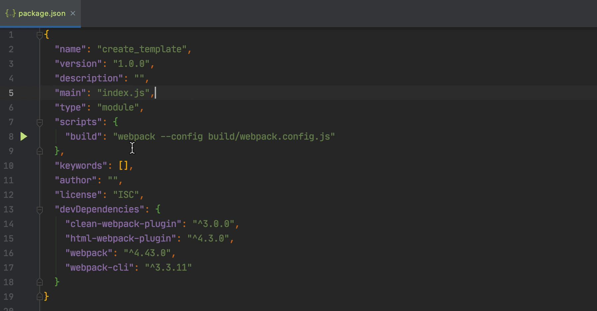

# Webstorm 下的 Webpack 配置提示 & 外部资源跳转

[示例源码](https://github.com/wizzeng/webpack_vue_bundle)

## 初始化 package.json

```bash
npm init --y
```

### 字段提示

通过 npm 的初始化命令，就得到了一个 `package.json` 文件。 Webstorm 提供了对其大部分字段的支持，按下 Ctrl / Command 键，并将鼠标移动到字段上即可得到字段说明。


### 字段跳转

按下 Ctrl / Command + 鼠标左键点击字段，可以跳转至字段的对应说明文件。如 `type` 字段在说明文件中说明了可使用的值(`module` 和 `commonjs(default)`)


同样，查看 `name` 字段的说明文件，很容易得知 npm 包命名规则：


## 搭建脚手架

接下来便是创建入口文件、配置文件和模板文件，新建文件时可使用相对路径命名，Webstorm 会自动根据路径名来创建对应的文件夹。

### 创建目录


创建后的目录如下：

```text
.
├── build
│   └── webpack.config.js # Webpack 配置文件
├── package.json
├── public
│   └── index.html # 模板
└── src
    └── index.js # 入口文件
```

### 修改模板

打开 `index.html`，如果在新建文件时选择的文件类型为 `HTML` ，则会生成一个 Webstorm 自带的 `HTML` 模板文件，但这个文件并不是很好用，
缺少很多实用属性，建议使用 `emmet` 提供的 HTML 模板。输入 `!` 并按下 `Tab` 就可以生成一个 `emmet` HTML 模板。生成后会自动高亮常用修改点，
这时可以使用 Tab / Enter 来切换或快速修改


### 配置 Webpack

移动到 `webpack.config.js` 上，引入 `Node.js` 中的 `path` 包，用于解析路径为绝对路径：

```javascript
const path = require('path');
```

默认情况下，Webstorm 不提供 Node Assistance，这时输入 `require` 引入对应包时不会获得提示，并标黄 `require` 和其引入的包。
在标黄区域按下 option / alt + enter 键，选择 `Enable Node assistance for Node.js` 即可获得 Node.js 语法解析和提示支持。


或是在设置中，开启 `Node` 支持


开启后，可以在左侧目录中的 `External Libraries` 中找到对应 `Node.js` 的 TS类型声明文件。


启用支持后，就可以愉快使用 commonJs 的包语法了。可以对 commonJs 的包进行跳转（跳转至 `package.json` 中 `main` 字段配置的文件），不论为 `Node` 自带的还是第三方包，只要安装后就可以进行跳转，甚至可以在 `markdown` 中的代码段也可以跳转。

启用后，在使用 require 导入包时，输入包名也能够获得对应提示。

### Webpack 配置

#### Webpack 准备

安装 `webpack` 和 `webpack-cli` 这两个依赖。

```bash
npm i webpack webpack-cli -D
```

这时可以继续编写我们的 Webpack 配置文件。Webstorm 提供了对
 [Webpack 配置文件的解析能力](https://www.jetbrains.com/help/webstorm/using-webpack.html#install_and_configure_webpack)，
只要在设置中配置 webpack 配置文件即可。


配置完成后，即可获得对 Webpack 配置文件的语法提示。


## 常用依赖 & Webpack 配置

```bash
npm i html-webpack-plugin clean-webpack-plugin -D
```

Webpack 配置如下，详细可参照 [Webpack 官方指南](https://www.webpackjs.com/guides/output-management/)：

 ```javascript
const path = require('path');
const HTMLWebpackPlugin = require('html-webpack-plugin')
const {CleanWebpackPlugin} = require('clean-webpack-plugin');

module.exports = {
    mode: 'development',
    entry: {
        main: path.resolve(__dirname, 'src/index.js')
    },
    output: {
        path: path.resolve(__dirname, 'dist'),
        filename: '[name].[hash:6].js'
    },
    loader: {

    },
    plugins: [
        new HTMLWebpackPlugin({
            template: path.resolve(__dirname, '../public/index.html'),
        }),
        new CleanWebpackPlugin()
    ]
}
 ```

## 配置 `npm script`

配置完成后，可以将打包 bash 命令设置为 `npm script` 来简化调用操作。Webstorm 对 `npm script` 提供了非常多的支持，在 `script` 命令中会嵌入当前命令行环境和语法提示，就好像是在一个真的命令行环境中启动一样。


同样的，在 `npm script` 命令中所涉及的路径和 `npx` 命令都可支持跳转。



最后，看到 `npm script` 左边的小三角了吗，点击它再点击 `Run`，就会自动创建一个启动配置，并开始运行该 `npm script`


## 多 Vendor 的 Webpack 配置

有时可能会需要在 Webpack 配置中使用多个 entry，比如使用该配置打包 jQuery Core，或是其他 Vendors，Webstorm 对这种场景的 Webpack 配置能够进行分析，并在大部分情况下得出正确提示和纠错。

### 创建一个 Fake jQuery

在项目根目录下创建一个 `vendors/fake_jQuery.js`，模拟引入 JQuery 并进行打包。

```javascript
// jQuery.js
const fake_jQuery = () => ({
    ajax: () => {
        console.log('Calling fake_jQuery');
        return Promise.resolve();
    }
});

window.fake_jQuery = fake_jQuery();
```

Webpack 配置改动如下：

```javascript
entry: {
    jQuery: path.resolve(__dirname, '../vendors/fake_jQuery.js'),
    main: path.resolve(__dirname, '../src/index.js')
}
```

**Tips: Webstorm 会追踪路径改动（虽然不一定准确，但也能减少不少负担），按照上述配置后，如果在 Webstorm 中 rename file，则会自动更新关联的路径字符串**


如果此时运行打包，会将 fake_jQuery 依赖的 Script 注入至 main 之前，那么在 main 的 entry 中，其实可以使用 fake_jQuery 方法了。
Webstorm 分析 Webpack 时会知晓这一点，在 main 中使用 fake_jQuery 环境时，会获得提示。如在 `src/index.js` 下使用 fake_jQuery，会得到提示。


## Webpack Alias

许多框架提供的脚手架（如 Vue），都会配置有 [`Webpack resolver alias`](https://webpack.js.org/configuration/resolve/#resolvealias)，即路径别名。拿 Vue Cli3 来举例，它会将 `@` 路径映射至项目路径的 `src` 目录，即在任意层级目录使用 `@` 来 `import`，都会取到 `src` 文件夹下的对应文件。

Webstorm 同样提供了对 `Webpack Alias` 的解析支持，能够提供 alias 路径下的提示和跳转功能。进行如下配置：

```javascript
// webpack.config.js
resolve: {
    alias: {
        '@': path.resolve(__dirname, '../src')
    }
}
```

创建 `src/utils.js` 用于导入：

```javascript
export const utils = {
    getCurrentTime() {
        return Date.now().toString();
    }
}
```

这时，如果前面配置 Webstorm 的 Webpack 配置文件路径正确，在 `src/index.js` 下 `import` `utils.js`，将获得补全和跳转功能。


## Link 依赖跳转

上述的 Vendor 打包方式一般只在给出未打包文件时采用，一般情况下给出的 UMD 包都会经过打包压缩，并发布在 CDN 上。如 JQuery 和 lodash。某些框架如 Bootstrap 还会要求引入外联 CSS。对于此类 link 资源，Webstorm 也可以很好地进行分析，并给出提示（深度打包并大量混入的包可能会无法正确分析）。

这里以 [lodash](https://www.lodashjs.com/) 为例，在 `public/index.html` 下放置 `lodash` 的 UMD 包，Webstorm 会给出一个警告。按下 alt / option + enter 键并选择 `Download Libraries`， Webstorm 会下载这个包并进行分析。分析结果用于给出语法提示。这里使用 `_.takeRight` 示例。


在 Webstorm 下载完 link 依赖后，在 `External Libraries` 下可以看到所引入的外部依赖。

**Important: 上述提示，Webstorm 目前对于相对协议无法很好支持并给出提示，暂无解决办法**

同样的，外联 CSS 样式也能够得到支持，也能够提供对应的 CSS 提示和跳转。这里我引入 [purecss](https://purecss.io/start/) 这个 UI 库，并放置了对应的 [Button 样式](https://purecss.io/buttons/) 来演示：


## 后记

目前配置就先到这里了，给自己立一个 Flag，下期继续配置，聊一聊 Vue 模板跳转、SCSS 支持、Git 支持和本地 History 这些功能点（如果来得及的话）。希望上面所说的功能点能够让你对 Webstorm 有一个新认识，学会这些 tricks 来提高自己的效率。你也可以和自己在使用的编辑器做一个横向对比，看一看支持程度如何。

制作不易，如果对你有帮助，留个 star 再走呗 QAQ.