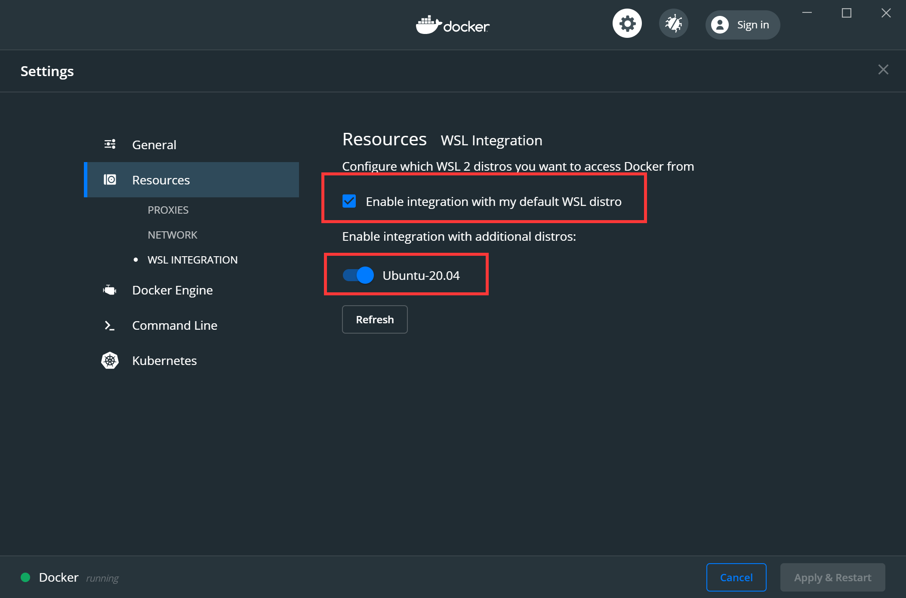
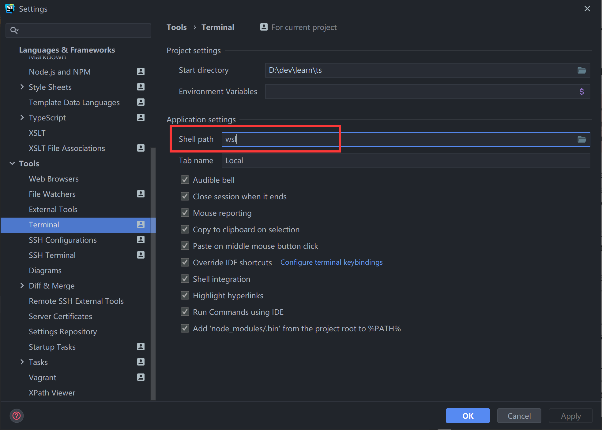
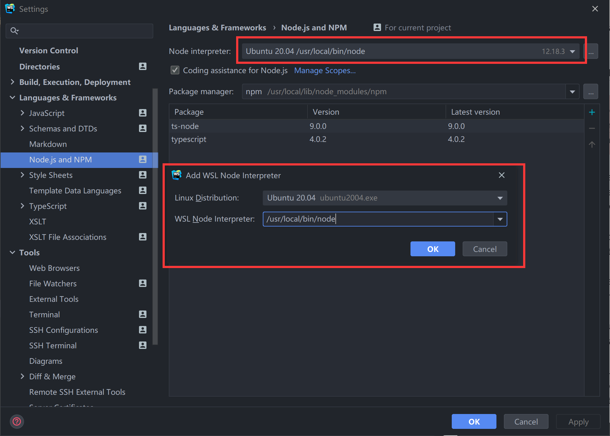

# 在 Webstorm 中愉快使用 WSL 开发 Node 应用

虽然 MS 从 `Vista` 开始引入了面对对象编程、功能更强的 `Powershell` 作为老态龙钟的 `CMD` 代替品，
但 `Powershell` 相对较长、较复杂的命令，相对于常年习惯于 `Bash` 无脑简单字符串解析的语法还是过重，
仍然不适合个人的使用习惯。此外，一些偏向于操作系统的 Node 命令只有在 BSD / Unix 环境下才能正常运行。

随着 `WSL(Windows Subsystem Linux)` 的推出，在 Windows 直接集成 Linux 开发环境变得更加简单。
WSL 2 能够让子系统直接运行 docker 命令，除了 WSL 不能直接访问 Windows localhost 这个问题外，
基本上算得上一个非常完美的开发环境。目前 VSCode 已经基本完美继承 WSL，只需要安装 `WSL-remote` 这个插件，
就可以直接控制 WSL 进行开发了（毕竟亲儿子）。但个人更倾向于使用 `Webstorm` 来开发，除了更丰富的语法
提示和跳转外，更丰富的 Git 功能也是让我难以舍弃 Webstorm 的一大理由。现阶段 `Webstorm` 提供的 WSL 集成
功能虽然有限，但也足够满足日常开发使用了。2020.2 版本下更是直接集成了 WSL 中 Git 的支持。下面简单介绍如果
使用 `WSL` + `Webstorm` 搭建 `Linux` 下的 `Node` 开发环境。

## WSL 安装

微软 在 Windows 1909 版本更新中带来了 WSL 2，直接在微软商店中下载安装即可。不过需要注意的是默认安装的 WSL 版本
为 1，需要按照官方文档转换为 2 才可正常跑 Docker。

[微软 WSL 安装文档](https://docs.microsoft.com/en-us/windows/wsl/install-win10)

当然，在安装完成后，别忘了进行换源、安装 node 和 node 版本切换工具。

- [Ubuntu 清华镜像站](https://mirrors.tuna.tsinghua.edu.cn/help/ubuntu/)

### 安装 Node 和 版本切换工具 n

安装 node & npm

```shell script
sudo apt-get install node.js -y
sudo apt-get install npm -y
```

安装 `nrm` 和 `n` 来进行 npm 源 / Node 版本切换

```shell script
sudo npm i nrm --g
sudo npm i n --g
```

可以使用 `nrm` 切换至国内镜像

```shell script
# 查看国内镜像
nrm ls
# 切换至淘宝源
nrm use taobao
```

### Git 设置

我选择的 Ubuntu 20.04 发行版中自带有 Git，只需要创建 RSA 密钥，设置一下 username / email 即可

```shell script
# 生成 RSA 密钥
ssh-keygen
git config --global user.name "John Doe"
git config --global user.email johndoe@example.com
```

### 走代理（可选）

因为 localhost 在 WSL 2 中的指向并不相同，所以如果想要在 WSL 2 中使用 Windows 下的 ShadowSocks / Clash 之类的科学上网，
则需要手动获得 Windows ip，来获得代理 url。参照如下文档：

- [WSL2 代理配置](https://jiayaoo3o.github.io/2020/06/23/%E8%AE%B0%E5%BD%95%E4%B8%80%E6%AC%A1WSL2%E7%9A%84%E7%BD%91%E7%BB%9C%E4%BB%A3%E7%90%86%E9%85%8D%E7%BD%AE/)

### Docker 安装

WSL 2 下安装 Docker 也十分简单，在官网安装 Windows 版本的 Docker，并在设置中启用 WSL 2 支持即可。



[Docker 下载](https://www.docker.com/get-started)

在 WSL 中，安装 Docker Client 即可使用 Docker 命令：

```shell script
sudo apt-get install docker.io
docker ps
```

## Webstom 集成

点击 `File | New Projects Settings | Settings/Preferences for New Projects` ，打开设置窗口.

### 设置 Terminal 为 WSL

转到 `File | Settings | Tools | Terminal` 下，将 `Shell Path` 改为 `wsl`。



### 设置 Node 解释器

在 `File | Settings | Languages & Frameworks | Node.js and NPM` 中，选择 `Node interpreter` 项右边的 `...`，并添加 WSL 中的 Node 解释器，选择为默认解释器即可。



### 测试

在 WebStorm 中任意创建一个 test.js，添加如下内容。

```javascript
const os = require('os');
console.log(os.platform());
```

`Ctrl + Shift + F10` 直接运行脚本，输出如下信息则为成功

```shell script
linux
```

#### npm scripts 测试

很多时候我们还会直接运行 npm script 来代替命令输入，可通过下面方法测试 npm script 运行环境.

```shell script
npm init --y
```

转到 `package.json` 下，在 `scripts` 节点下添加一个 script 指向上面所创建的 `test.js` 文件.

```json
{
  "scripts": {
    "test": "node src/node.js"
  }
}
```

直接点击 script 左侧的三角形，选择 Run，同样输出 `linux` 即可。
